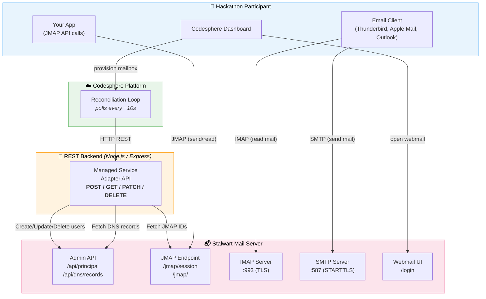
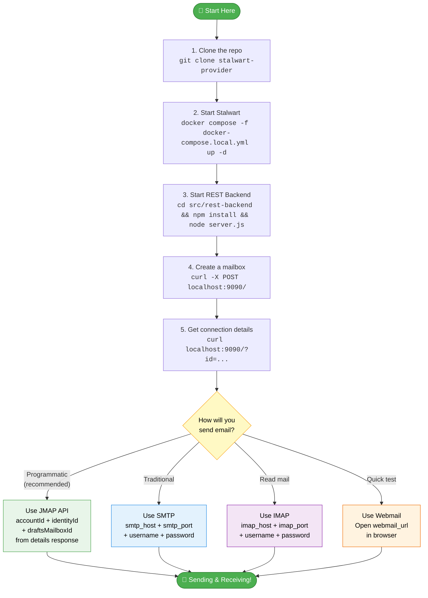
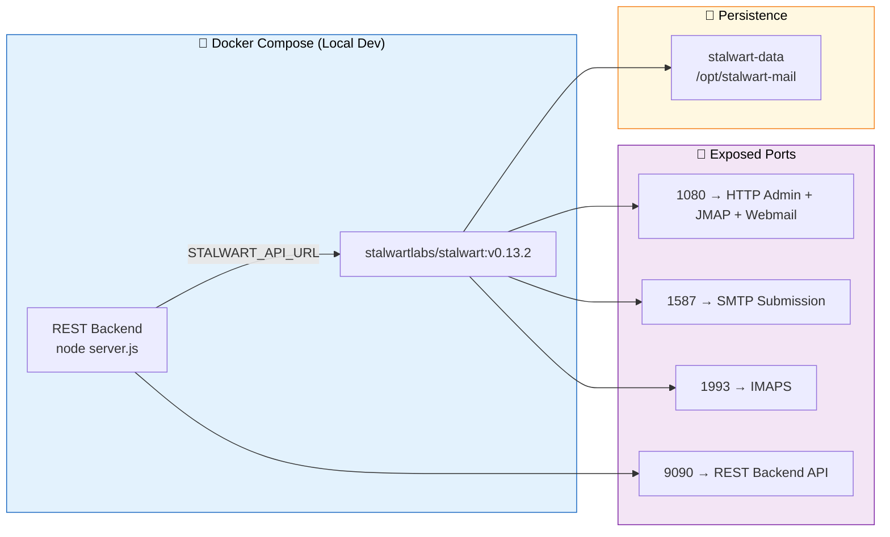
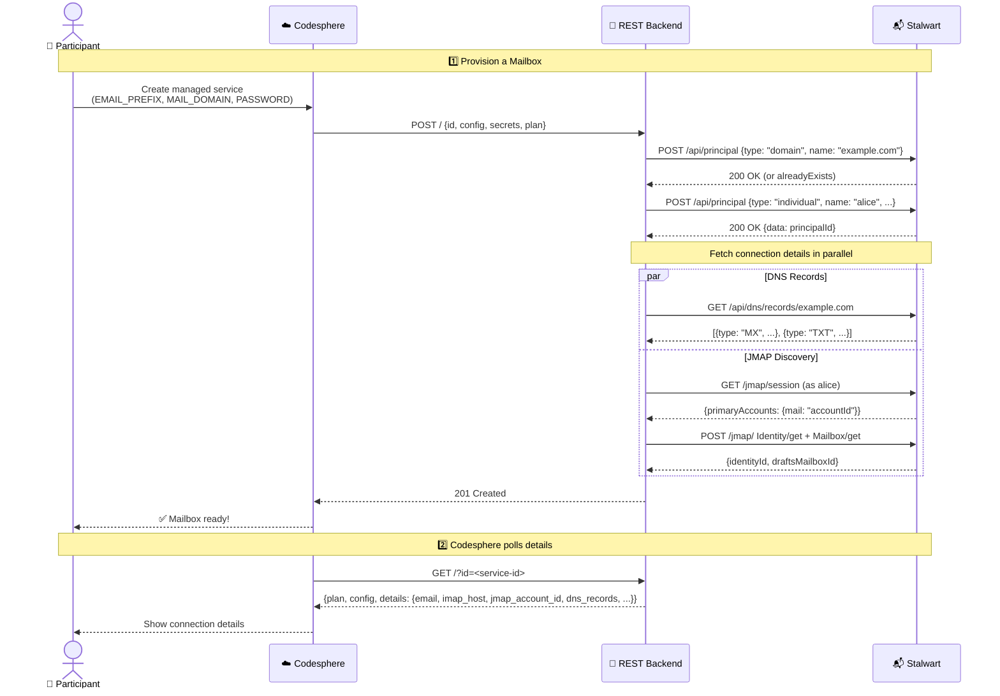
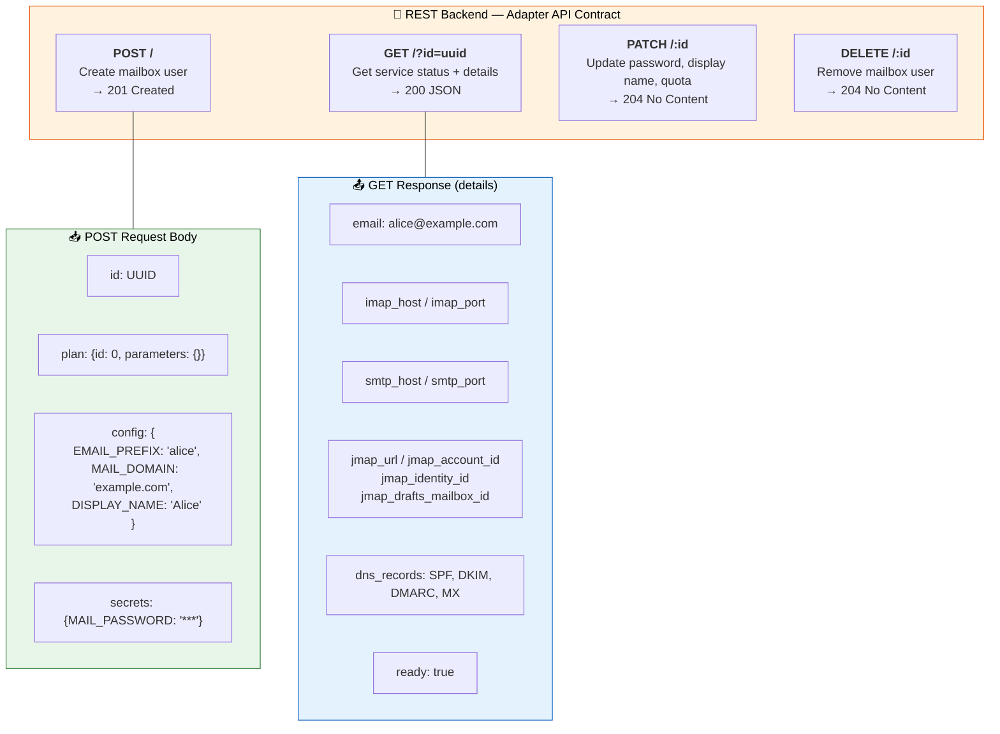
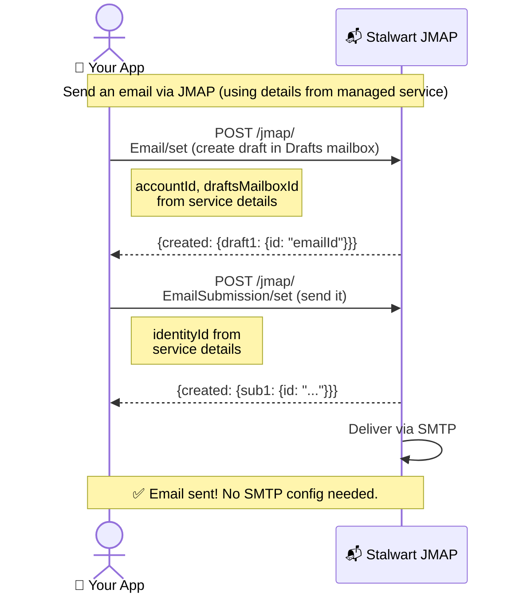

# 📬 Stalwart Mail Provider — Hackathon Guide

Welcome! This guide will help you understand, run, and extend the **Stalwart Mailbox Provider** — a Codesphere managed service that provisions email accounts on demand.

---

## What Does This Project Do?

It lets anyone create a **fully functional email account** (with IMAP, SMTP, JMAP, and webmail) by clicking a button in Codesphere. Under the hood, a Node.js REST backend talks to [Stalwart Mail Server](https://stalw.art/) to create users, fetch DNS records, and discover JMAP session details — all automatically.

---

## Architecture Overview



**How the pieces connect:**

| Component | Role | Tech |
|-----------|------|------|
| **Codesphere** | Orchestrates provisioning, shows UI to users | Platform |
| **REST Backend** | Translates Codesphere API calls → Stalwart API calls | Node.js + Express |
| **Stalwart** | Stores mailboxes, handles email protocols | Rust mail server |

---

## Quickstart Flowchart



---

## Step-by-Step Setup

### Prerequisites

- Docker and Docker Compose
- Node.js 18+
- `curl` (for testing)

### 1. Start Stalwart Mail Server

```bash
docker compose -f docker-compose.local.yml up -d
```

This gives you a local Stalwart instance:



| Port | Service | What it's for |
|------|---------|---------------|
| `1080` | HTTP | Admin UI, Webmail, JMAP endpoint |
| `1587` | SMTP | Send emails (submission port) |
| `1993` | IMAPS | Read emails (TLS) |
| `9090` | REST Backend | Codesphere adapter API |

> **Admin login:** `admin` / `localdev123` at http://localhost:1080

### 2. Start the REST Backend

```bash
cd src/rest-backend
npm install

STALWART_API_URL=http://localhost:1080 \
STALWART_ADMIN_TOKEN="admin:localdev123" \
STALWART_IMAP_HOST=localhost \
STALWART_SMTP_HOST=localhost \
STALWART_IMAP_PORT=1993 \
STALWART_SMTP_PORT=1587 \
PORT=9090 \
node server.js
```

### 3. Create a Mailbox

```bash
curl -s -X POST http://localhost:9090/ \
  -H 'Content-Type: application/json' \
  -d '{
    "id": "aaaaaaaa-bbbb-cccc-dddd-eeeeeeeeeeee",
    "plan": {"id": 0, "parameters": {}},
    "config": {
      "EMAIL_PREFIX": "alice",
      "MAIL_DOMAIN": "example.com",
      "DISPLAY_NAME": "Alice"
    },
    "secrets": {"MAIL_PASSWORD": "supersecret123"}
  }'
```

### 4. Get Connection Details

```bash
curl -s http://localhost:9090/?id=aaaaaaaa-bbbb-cccc-dddd-eeeeeeeeeeee | python3 -m json.tool
```

You'll get back everything needed to connect:

```json
{
  "aaaaaaaa-bbbb-cccc-dddd-eeeeeeeeeeee": {
    "plan": { "id": 0, "parameters": {} },
    "config": { "EMAIL_PREFIX": "alice", "MAIL_DOMAIN": "example.com", "DISPLAY_NAME": "Alice" },
    "details": {
      "email": "alice@example.com",
      "username": "alice",
      "mail_domain": "example.com",
      "imap_host": "localhost",
      "imap_port": 1993,
      "smtp_host": "localhost",
      "smtp_port": 1587,
      "jmap_url": "http://localhost:1080/jmap",
      "jmap_account_id": "h",
      "jmap_identity_id": "b",
      "jmap_drafts_mailbox_id": "d",
      "webmail_url": "http://localhost:1080/login",
      "dns_records": "MX example.com. 10 ...\nTXT example.com. v=spf1 ...",
      "ready": true
    }
  }
}
```

---

## How Provisioning Works



---

## REST Adapter API Reference



| Endpoint | Method | Purpose | Response |
|----------|--------|---------|----------|
| `/` | `POST` | Create a new mailbox | `201` (empty body) |
| `/?id=<uuid>` | `GET` | Get mailbox status & connection details | `200` JSON |
| `/:id` | `PATCH` | Update display name, quota, or password | `204` |
| `/:id` | `DELETE` | Delete mailbox and Stalwart user | `204` |

### Config Fields

| Field | Type | Mutable | Description |
|-------|------|---------|-------------|
| `EMAIL_PREFIX` | string | ❌ immutable | Local part of the email (before `@`) |
| `MAIL_DOMAIN` | string | ❌ immutable | Email domain (auto-created in Stalwart) |
| `DISPLAY_NAME` | string | ✅ | Friendly name shown in email clients |
| `QUOTA_MB` | integer | ✅ | Storage quota in MB (0 = unlimited) |

### Secret Fields

| Field | Type | Description |
|-------|------|-------------|
| `MAIL_PASSWORD` | password | Mailbox login password |

---

## Sending Email via JMAP

JMAP is the modern replacement for SMTP. The managed service returns everything you need — no discovery step required.



### Copy-Paste Example

Replace the values from your `GET` response:

```bash
curl -s http://localhost:1080/jmap/ \
  -u 'alice:supersecret123' \
  -H 'Content-Type: application/json' \
  -d '{
    "using": [
      "urn:ietf:params:jmap:core",
      "urn:ietf:params:jmap:mail",
      "urn:ietf:params:jmap:submission"
    ],
    "methodCalls": [
      ["Email/set", {
        "accountId": "<jmap_account_id>",
        "create": {
          "draft1": {
            "mailboxIds": {"<jmap_drafts_mailbox_id>": true},
            "from": [{"name": "Alice", "email": "alice@example.com"}],
            "to": [{"name": "Bob", "email": "bob@example.com"}],
            "subject": "Hello from the hackathon!",
            "textBody": [{"partId": "body", "type": "text/plain"}],
            "bodyValues": {
              "body": {
                "value": "This email was sent programmatically via JMAP!",
                "isEncodingProblem": false
              }
            }
          }
        }
      }, "c1"],
      ["EmailSubmission/set", {
        "accountId": "<jmap_account_id>",
        "create": {
          "sub1": {
            "identityId": "<jmap_identity_id>",
            "emailId": "#draft1"
          }
        }
      }, "c2"]
    ]
  }'
```

> **Tip:** The `#draft1` reference automatically resolves to the email ID created in the first method call.

---

## File Structure

```
stalwart-provider/
├── config/
│   └── provider.yml             ← Provider definition (schemas, plans, backend URL)
├── src/
│   └── rest-backend/
│       ├── server.js            ← REST backend (the main code!)
│       └── package.json
├── docker-compose.local.yml     ← Local Stalwart for development
├── scripts/
│   ├── validate.sh              ← Validates provider.yml
│   └── register.sh              ← Registers provider with Codesphere
├── Makefile                     ← make validate / make register
├── STALWART_SETUP.md            ← Production deployment guide
└── HACKATHON.md                 ← You are here!
```

---

## Ideas for Extending

Here are some things you could build on top of this:

| Idea | Difficulty | Description |
|------|-----------|-------------|
| **Email-sending microservice** | ⭐ Easy | Build an app that provisions a mailbox and sends transactional emails via JMAP |
| **Newsletter platform** | ⭐⭐ Medium | Create a service that sends bulk emails using JMAP batch operations |
| **Multi-tenant SaaS email** | ⭐⭐ Medium | Let each customer bring their own domain, auto-configure DNS |
| **Email webhook bridge** | ⭐⭐ Medium | Poll JMAP for new emails and forward them to a webhook |
| **Persistent storage** | ⭐⭐ Medium | Replace the in-memory `Map()` with a database (SQLite, PostgreSQL) |
| **Mailing list manager** | ⭐⭐⭐ Hard | Use Stalwart's `list` principal type to manage mailing lists |

---

## Troubleshooting

| Problem | Cause | Fix |
|---------|-------|-----|
| `Connection refused` on port 1080 | Stalwart not running | `docker compose -f docker-compose.local.yml up -d` |
| `401 Unauthorized` from Stalwart | Wrong admin password | Check `STALWART_ADMIN_TOKEN` matches `admin:localdev123` |
| Domain creation fails | Stalwart IP-blocked you | `docker compose -f docker-compose.local.yml down -v && docker compose -f docker-compose.local.yml up -d` (wipes data!) |
| JMAP details are empty | User just created, needs a moment | JMAP session may take a second to initialize. Retry the GET. |
| Port 9090 in use | Old backend still running | `lsof -ti:9090 \| xargs kill` |
| Emails to Gmail rejected | Missing DNS/TLS (local only) | This is expected locally. See `STALWART_SETUP.md` for production DNS config. |

---

## Environment Variable Reference

| Variable | Required | Default | Description |
|----------|----------|---------|-------------|
| `STALWART_API_URL` | ✅ | — | Stalwart admin API base URL |
| `STALWART_ADMIN_TOKEN` | ✅ | — | `user:password` for Basic Auth or Bearer token |
| `STALWART_IMAP_HOST` | ✅ | — | Public IMAP hostname |
| `STALWART_SMTP_HOST` | ✅ | — | Public SMTP hostname |
| `STALWART_IMAP_PORT` | — | `993` | IMAP port |
| `STALWART_SMTP_PORT` | — | `587` | SMTP submission port |
| `STALWART_MAIL_DOMAIN` | — | — | Default domain (if not set per-service) |
| `PORT` | — | `8080` | Backend listen port |
| `AUTH_TOKEN` | — | — | Bearer token for securing the backend |
